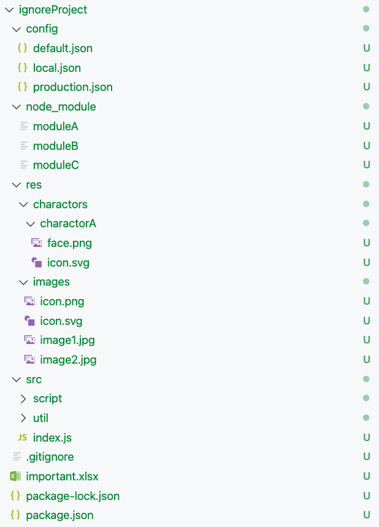

## Demo 06 - Writing .gitignore
### Overview
มาลองเขียน .gitgnore กัน

### สถานะการณ์

- ignore ทุกไฟล์ใน `config/` ยกเว้น `default.json`
- ignore **.png/.jpg** ทุกไฟล์
- ignore `node_modules`
- ไฟล์ **.xlsx** ที่เป็น **credential** ควรถูก ignore
- **ไม่ ignore ** `important.xlsx`-`
- ลองศึกษาดูว่าควร ignore `package-lock.json` หรือไม่

### ขั้นตอนการทำ 
1. Checkout to a new branch.
   ```
   git checkout -b demo-06-writing-gitignore-${nickname} origin/demo-06-writing-gitignore
   ```
2. ลองดู `.gitignore` จะมี **DO_NOT_COMMIT_THIS_FILE** อยู่บรรทัดสุดท้าย
3. แต่มีไฟล์ **DO_NOT_COMMIT_THIS_FILE** ซึ่ง tracked อยู่แล้ว ทำให้ .gitignore ไม่มีผล
4. สมมุติว่าไฟล์ **DO_NOT_COMMIT_THIS_FILE** เป็น credential ซึ่งไม่ควรถูกเก็บใน history เราควรจะลบอย่างไรและลองลบดู
5. commit งาน
6. แตก file ignoreProject.zip
  ```
  # MACOS & Linux
  unzip ignoreProject.zip
  ```
7. ลองเขียน ignore file ตามหัวข้อสถานะการณ์
8. Commit your work.
9. Run `git push -u origin demo-06-writing-gitignore-${nickname}`