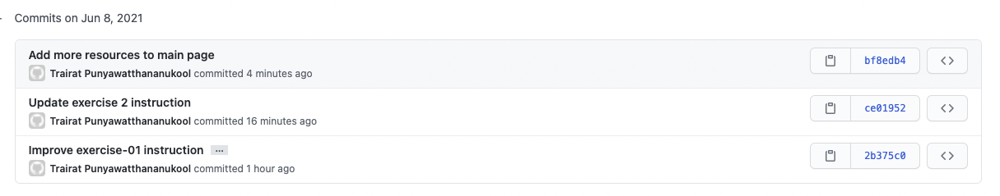
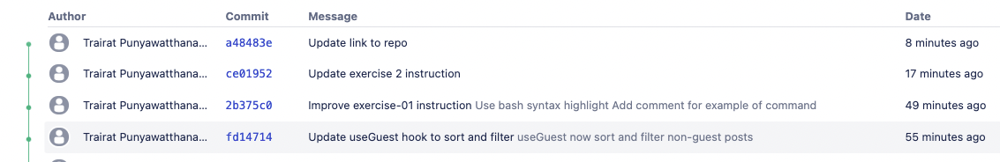

## Demo 08 - Working with remote repository
### Overview
### Git remote
remote คือ remote repository ที่ฝากอยู่บน server เช่น github หรือ bitbucket โดยปกติเราใช้มีแค่อันเดียว แล้วแทบจะทุกคนก็จะตั้งชื่อมันว่า origin แต่จริงๆเราจะตั้งอะไรก็ได้

| Command      | Description |
| ----------- | ----------- |
| git remote      | List remote |
| git remote get-url remote name  | See url of remote |
| git remote set-url remote name url | Set url of remote        |

#### Remote Branch
แต่ละ branch ของเราจะมี remote branch อยู่ โดยปกติถ้า branch ของเราชื่อ `branch-abc` remote branch ของ branch นั้นก็จะเป็น `origin/branch-abc` ถ้าตอนที่เรา `git push` ถ้า branch มี remote อยู่แล้ว git จะ push ไปที่ remote branch เอง แต่ถ้าไม่มี git จะเตือนเราให้เรา update ค่า remote branch ก่อนด้วยคำสั่ง `git push -u origin branch_name`
#### Use case: เปลี่ยน remote repository
เช่นเราอยากเปลี่ยน repository ที่อยู่บน bitbucket ไปที่ github แทน
1. สร้าง repository ใน github
2. `git remote set-url origin <remote url>`
3. `git push` เพื่อ upload repo ในเครื่องเราไป
#### Use case: เปลี่ยน auth method
ปัจจุบันเรามันจะใช้ ssh key ในการ authorize git แทนที่จะพิม username/password ตลอด
1. สร้าง ssh key ด้วยคำสั่ง ssh-key-gen
2. เพิ่ม public key ใน bitbucket
3. เปลี่ยน remote url เป็น `git@bitbucket.org:username/reponame` ด้วยคำสั่ง
   ```
   git remote set-url origin git@bitbucket.org:username/reponame
   ```
### Git fetch
เป็นคำสั่งที่ใช้ download commit ต่างๆจาก remote และ ขยับ remote branch ไปที่ commit ล่าสุดใน remote repository
### Git pull
จริงๆแล้ว git pull คือการทำสองคำสั่งในคำสั่งเดียวนั่นคือ `git fetch` + `git merge`
### Git push
ส่วน git push ก็คือ upload commit ขึ้นไปบน server และ ขยับ remote branch ตาม commit ในเครื่องของเรา

### Multiple remote use case
พี่มี template ของ repository นี้ ฝากไว้กับ github แต่ละครั้งที่่มี workshop ใหม่พี่จะทำการ fork repository จาก github เอาไปไว้ใน bitbucket แทน บางครั้งที่ทำการ Update template บน github ปัญหาคือพี่จะเอา change จาก github มา merge เข้าไปใน bitbucket ได้อย่างไร เช่น ในรูปพี่มีการเพิ่ม resourece ในหน้าแรก (commit id `bf8edb4`) ใน github แล้วพี่อยาก merge commit นั้นเข้ามาใน repository บน bitbucket จะทำได้ยังไง


#### Solution
เพิ่ม remote repository ในเครื่องเราเพิ่มให้มีทั้ง bitbucket และ github จากนั้นเครื่องเราจะเห็น branch ของทั้งสอง repo เราก็จะสามารถทำการ merge ได้
#### ขั้นตอน
1. เพิ่ม remote repository ใหม่
   ```
   git remote add origin-github <url-to-github-repo>
   git fetch origin-github
   ```
2. เราจะเห็น branch `remotes/origin-github/master`
   ```
   git branch -r
   ```
3. Merge branch `master` ในเครื่องเรากับ `remotes/origin-github/master`
   ```
   git merge remotes/origin-github/master
   ```
4. เราก็จะมีงานจาก `master บน github` ใน `master` ของเราแล้ว!