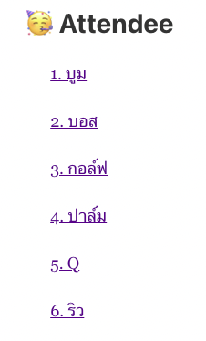
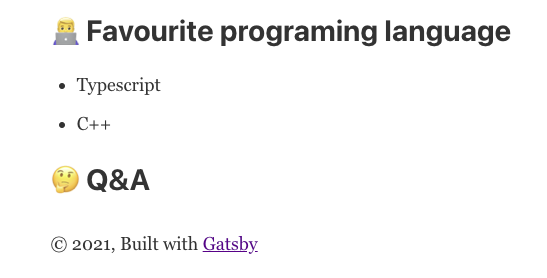

# Exercise 02 Part 2 - Working with other

## Overview
Part 2 เราจะมาลองเป็นคนตรวจงานกันบ้าง

## Prerequisite
1. ดูเลขที่ของตนในหน้าแรก
   
   
## ขั้นตอนการทำ

1. สร้าง branch ของตัวเอง ชื่อ `exercise-02-pt2-${nickname}` เช่น `exercise-02-pt2-sam` ผ่าน `bitbucket` โดย fork จาก branch `master`
2. checkout branch ที่เพิ่งสร้างในเครื่องตัวเอง
   ```bash
   git fetch
   git checkout exercise-02-pt1-${nickname} # เช่น git checkout exercise-02-pt1-sam
   ```
3. เพิ่ม Section Q&A เข้าไป**ล่างสุด**ในหน้าของตัวเองที่ทำไปใน `exercise 2 part 1` ใส่แค่หัวข้อไว้ก่อน เช่น
   
   
4. เปิด pull request ใน bitbucket ชื่อ `Exercise-02-pt2-${เลขที่}.${nickname}` เช่น `Exercise-02-pt1-1.sam`
5. ให้ใช้เลขที่หน้าชื่อในหน้าแรกเป็นเลขที่ของตน (ดูตัวอย่างในหัวข้อ Prerequisite ในหน้านี้)
6. ให้คนเลขที่ 1 คู่กับ 2, 3 คู่กับ 4 ไปเรื่อยๆ คนที่คู่กันจะเรียกว่า Buddy
7. ให้แต่ละคนเข้่าไปดู **Pull request** ของ **buddy** และ **comment** ถามตรงหัวข้อ **Q&A** อย่างน้อย **3** ข้อ
8. สร้าง task สำหรับแต่ละคำถามและกด request change
9. ไปดู **comment** ใน **PR** ของ**ตัวเอง**แล้วตอบคำถามในหน้าของตัวเอง (ไม่ต้องตอบ comment ใน bitbucket)
10. Commit & Push แล้วติ๊ก task ว่าเสร็จแล้วใน bitbucket
11. ไปเช็คงานที่ใน **PR** ของ **buddy** แล้วเปลี่ยนเป็น approve เมื่อพอใจ (จะ comment เพิ่มก็ได้แล้วแต่เลย)
12. อย่าเพิ่ง merge รอทุกคนเสร็จก่อน
13. รอก่อนเดี๋ยวประกาศ (หรือไปแอบดูใน commit history ก็ได้)

### Bonus
พี่จะเปิดเว็บนี้ไว้ ถ้าอยากแก้ไขอะไรหรืออยากจะแชร์อะไรเปิด PR มาได้เลย